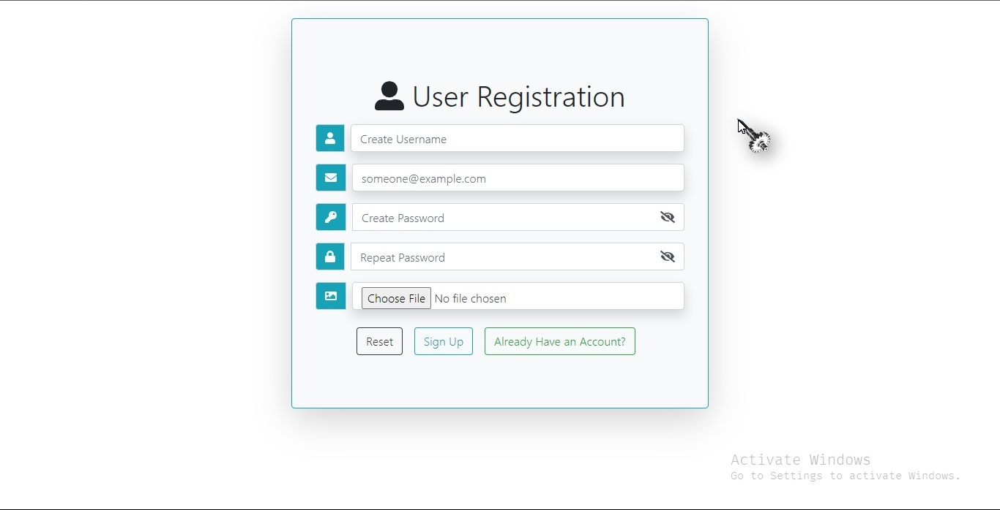
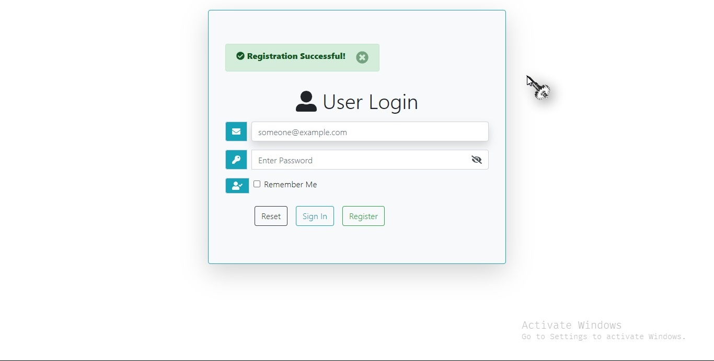

# Setup

---
Follow vividly this instructions to set up  the project.

1. [VSCode Installation](#vscode-installation)
2. [Xampp Installation](#xampp-installation)
3. [Download Project](#download-project)
4. [Export Database](#export-database)

## VSCode Installation

- [Download VSCode](https://code.visualstudio.com/download)
- During the installation, add VSCode to path.

## Xampp Installation

- [Download Xampp](https://www.apachefriends.org/download.html)
- During the installation, add Xampp to path.

## Download Project

Follow either ways to get this project to your PC

1. Download the project and extract it. Copy the extracted folder to *C:/xampp/htdocs/* or the installation path of Xampp on your PC. Right click and open the project in VSCode.
1. Clone the repository in *C:/xampp/htdocs/*. Right click and open the project in VSCode.

## Export Database

- Start your Xampp Control  Panel
  - Start Apache
  - Start MySQL
- Run __localhost/phpmyadmin__
  - Create a new database named __proj__. If you create the database with a different name then enable to edit and rename the database in __proj/includes/connection.php__ file.
  - Export the contents  of the file *proj/proj.sql* or *project-name/proj.sql* to your new database.
- Start your browser and run __localhost/project__ or __localhost/project-name__ if you renamed the project.

 

Enjoy!
